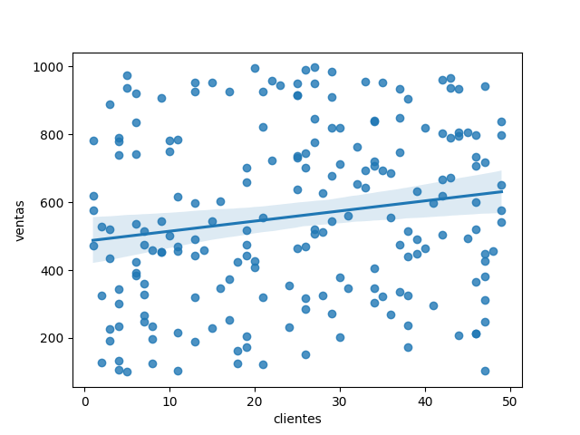

# 📊 E-commerce Sales Analysis

## ▶️ How to Run

1. Clone the repository
2. Open the notebook in Jupyter or Google Colab
3. Run all cells

*Required libraries:
- pandas
- numpy
- matplotlib*

# This project analyzes e-commerce sales data using exploratory data analysis techniques to identify patterns and support data-driven business decisions.

## 🛠️ Tools
- Python
- pandas
- numpy
- matplotlib

## 📈 Analysis Performed
- Average sales by country
- Sales by category
- Sales evolution over time
- Relationship between customers and sales

## 🔍 Insights

- No clear monthly pattern was observed due to the random nature of the dataset.
- There is no significant correlation between customers and sales.
- Some categories show higher sales volume than others.

## 📷 Sales by Category

## 🤑 Customer vs Sales Correlation

## 🚀 Conclusion

This project allowed exploration of data wrangling, exploratory data analysis, and visualization techniques using Python libraries such as pandas, numpy, and matplotlib.

The analysis identified differences in sales across categories and countries, while also evaluating possible relationships between customers and sales performance.
